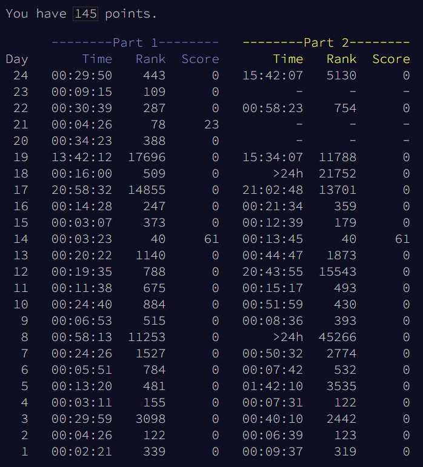

# Advent of Code 2023
## RobertJN64 Solutions

All solutions were written with no assistance from forums.
Solutions are not necessarily optimal - but many use interesting
techniques.

The repo also contains the template file I used, as well as the scripts
to launch each part quickly.

Summary:
 - Better scores than last year (more solves, better leaderboard positions)
 - First week part2 was strangely difficult, probably to stop ChatGPT solvers
 - Some extremely fun puzzles later on: Day10 pipe maze, Day 16 lasers, Day 24 hailstones
 - Day 19 was most fun I've had doing AoC

Thoughts on Puzzles:
 - Day 1: Much harder than last year, overlapping strings made my first solution fail
 - Day 2: Fun puzzle, great score!
 - Day 3: Annoying puzzle (because I scored poorly), so many off by 1 errors...
 - Day 4: Straightforward, clever twist
 - Day 5: Part 1 is fun... WTF
 - Day 6: Easy, part 2 brute force in 5 seconds
 - Day 7: I don't really like poker puzzles, cool use of `__gt__` though
 - Day 8: Part 2 was the second "hard puzzle", mostly b/c needed a lot of assumptions
 - Day 9: Simple derivative puzzle, very fun
 - Day 10: Part 2 was an exceptional quality puzzle, I'm very proud of my winding direction based solution
 - Day 11: Fun, good prevention of bruteforce on part2
 - Day 12: Cacheing made part2 1000x faster - good puzzle
 - Day 13: I'm bad at reading, missed that the old mirror line might still be valid
 - Day 14: TOP 50 both parts!! Super simple to write solution with cacheing and jump ahead on part 2
 - Day 15: Hashmaps - took me a bit to write part 2 b/c I'm bad at reading
 - Day 16: Fun puzzle - optimized with sets() after using line_profiler
 - Day 17: Very hard because bruteforce didn't work and traditional maze algorithms were hard to adapt
 - Day 18: First part2 I didn't solve in 24 hrs
 - Day 19: Excellent puzzle, super fun recursive solution in part2
 - Day 20: Fun puzzle, confusing directions, no idea on how to do part2
 - Day 21: Part 1 easy, no idea on how to approach part 2
 - Day 22: Fun physics puzzle, part 2 wasn't bad
 - Day 23: Easy part 1, part 2 infinite grid isn't happening
 - Day 24: Part 1 solve using custom equation solver, part 2 using a combination of brute force and custom equation solvers - hardest AoC I have ever solved
 - Day 25: Currently unsolved (too slow for real data), need more graph theory knowledge...